# Lesson: Advanced Interaction Technologies & Applications

### First and Last Name: Evangelia Despotidou
### University Registration Number: dpsd19030
### GitHub Personal Profile: [Evedes01](https://github.com/Evedes01)
### Advanced Interaction Tecnologies & Applications Github Personal Repository: [Advanced Interaction Technologies Personal Repository](https://github.com/Evedes01/Advanced-Interaction-Tecnologies-Applications-Individual-Assignment)

# Introduction

Σε αυτό το μάθημα ασχοληθήκαμε με εφαρμογές αλληλεπίδρασης χρησιμοποιόντας το Processing και για τα 2 τελικά bonus αξιοποιήσαμε την κάμερα Kinect.

# Summary

Κατά τη διάρκεια αυτού του μαθήματος ασχοπλήθηκα με 3 βασικά παραδοτέα που κλιμακοτά εξελίσσονταν και γινόντουσαν πιο πολύπλοκα και δυναμικά. 

 Αρχικά, στο πρώτο παραδοτέο έγινε η πρώτη γνωριμία με το Processing και την χρήση της κάμερας μέσω του προγράμματος. Επίσης, μάθαμε πως να βάζουμε φωτογραφίες και βίντεο, πως να κάνουμε το πρόγραμμα να εκτελεί κάποια εντολή διαβάζοντας ένα QR code και πως να αξιοποιούμε τους ar markers για την κατασκευή προγράμματος augmented reality.

 Στο 2ο παραδοτέο δώθηκε έμφαση στην αναγνώριση κίνησης από την κάμερα και την αντικατάσταση των pixels με καινούρια, δημιουργώντας ένα δυναμικό περιβάλλον.

 Για το 3ο παραδοτέο έγινε χρήση της βιβλιοθήκης και της εφαρμογής reacTIVision, μία διαφορετική προσέγκιση της αλληλεπίδρασης με μάρκερς.

# 1st Deliverable
>##  1. Video Capture: 
Για το πρώτο βήμα, ξεκίνησα κατεβάζοντας στο Processing το library για το Video και έπειτα ακολούθησα τις οδηγίες του [συδέσμου](https://processing.org/tutorials/video/#live-video) και του παραδείγματος 16-1 του βιβλίου Learning Processing για να γράψω τον κώδικα. Αφού άλλαξα τις διαστάασεις του παραθύρου

έτρεξα το πρόγραμμα.
 'Οπως φαίνεται παρακάτω, το πρόγραμμα τρέχει σωστά και εμφανίζεται το βίντεο που καταγράφει η κάμερα.

Και η ένδειξη στον compiler:

 

>##  2. Recorded video: 
Για αυτό το βήμα, συμβουλευόμενη τα παραδείγματα 16-4 και 16-5 του βιβλίου και χρησιμοποιώντας το library που είχα κατεβάσει στο προηγούμενο βήμα, υλοποίησα την προβολή του βίντεο. Αρχικά, έγραψα τον κώδικα σ΄ύμφωνα με τα παραδείγματα και και δηημιούργησα έναν φάκελο "data" (στον ίδιο φάκελο με το πρόγραμμα), όπου μέσα τοποθέτησα το βίντεο. 

Συνειδητοποιώντας τον όγκο του αρχείου, επεξεργάστηκα το βίντεο με σκοπό να το μικρύνω (με compression και επιταχύνοντας το αρχικό animation, για να ελαχιστοποιηθεί το μήκος του).

Όσων αφορά τον κώδικα, πάλι προσάρμωσα τις διαστάσεις του παραθύρου, ώστε να ταιριάζουν με αυτές του βίντεο.

Έπειτα, το έτρεξα και δοκιμασα την επιβράδυνση και την επιτάχυνση του βίντεο σερνοντας το ποντίκι οριζοντίως πάνω του...

 

και λειτούργησε ομαλά, το βίντεο έπαιζε σε λούπα και στις διαφορετικές ταχύτητες.

 

>##  3. QR Code:  
Για την δημιουργία του QR code επισκέφτηκα [αυτή](https://www.qrcode-monkey.com/?utm_source=google_c&utm_medium=cpc&utm_campaign=&utm_content=&utm_term=qrcode%20monkey_e&gclid=CjwKCAjw8JKbBhBYEiwAs3sxN6yxfBJHuRFeC35FTpOlhm42mXNSqnNOPvVUIutf8s3RqK6aTZ6WOBoC8PsQAvD_BwE) την ιστοσελίδα και αφού το έφτιαξα, το κατέβασα και το τοποθέτησα στον φάκελο data.

  Για το πρόγραμμα, αρχικά, κατέβασα την βιβλιοθήκη για το QR Code από το σχετικό [link](https://shiffman.net/p5/qrcode-processing/) (ανοίγοντας τα Developer tools, καθώς αντιμετώπιζε κάποιο πρόβλημα το link στην ιστοσελίδα), αλλά επειδή δεν κατάφερα να την αποθηκεύσω σωστα, τελικά, την κατέβασα μέσω του Processing, όπου καταχωρήθηκε αμέσως.
 Στη συνέχεια, αντέγραψα τον κώδικα της ιστοσελίδας στο Processing και προσέθεσα και κάποια στοιχεία του κώδικα από το παράδειγμα 15-1 του βιβλίου, όπως το "PImage img;" για να μπορώ να εισάγω και να χρησιμοποιήσω την εικόνα του QR:

Προσάρμωσα τις διαστάσεις του παραθύρου (πορτοκαλί) και της εικόνας (γαλάζιο):

Για να μπορεί να ανοίξει το decoded κείμενο/link του GitHub προφίλ μου σε νέο παράθυρο στον browser:
 
 Χρησιμοποίησα ένα switch case όπως στον κώδικα του βήματος 4, και προσέθεσα και προσάρμωσα τη γραμμή κώδικα που βρήκα [εδώ](https://processing.org/examples/embeddedlinks.html), αντικαθιστώντας το απλό link με την εντολή "decoder.getDecodedString()" που περιέχει το decoded link του QR σε string.

Τέλος, έτρεξα το πρόγραμμα:
  Εμφανίστηκε η εικόνα του QR (και από τον compiler φάνηκε ότι διάβασε το QR code)

 

και πατώντας το πλήκτρο "i" (όπως είναι καταχωρημένο στο switch case), το πρόγραμμα επιτυχώς άνοιξε το GitHub profile στον browser.

 

>##  4. QR Code - Camera Read: 

Για αυτό το βήμα χρησιμοποίησα το QR code και το library από το προηγούμενο βήμα, και, όπως προηγουμένως, εισήγαγα στο data file την εικόνα του QR code.

 Όσων αφορά τον κώδικα, άνοιξα και επεξεργάστηκα το παράδειγμα _QRCodeExample_. Ο κώδικας παρέμεινε σταθερός, ενώ οι βασικές αλλαγές που έκανα ήταν στις εντολές του switch case:
  
Πρώτα στην εισαγωγή του προσωπικού μου QR code...

και έπειτα, προσθέτοντας ένα νέο case, το πλήκτρο "o", με το οποίο ενεργοποιείται η εντολή να ανοίξει το αποκωδικοποιημένο link στον browser.

 (χρησιμοποίησα την ίδια γραμμή κώδικα με το βήμα 3, από αυτή τη [σελίδα](https://processing.org/examples/embeddedlinks.html))

 Όταν έτρεξα το πρόγραμμα, το παράθυρο με το βίντεο από την κάμερα εμφανίστηκε κανονικά, ενώ η μόνη μικρή δυσκολία ήταν να αναγνωρίσει σωστά η κάμερα το QR code. Στο status mmessage φαίνεται όταν το αναγνωρίζει επιτυχώς (κάθε φορά τραβώντας screenshot με το "space-bar"), 

  

ενώ στον compiler οι προσπάθειες αναγνώρισης.

Παρ'όλα αυτά, το πρόγραμμα λειτούργησε και πατώντας το "o", το προφίλ άνοιξε επιτυχώς σε καινούριο tab στον browser.

 
 
  

>##  5. Augmented Reality:  

Για το 5ο βήμα ξεκίνησα κατεβάζοντας τον φάκελο zip (“nyar4psg.zip”) που περιέχει την βιβλιοθήκη NyARToolkit από τον [σύνδεσμο](https://github.com/nyatla/NyARToolkit-for-Processing/releases) στο GitHub, τον οποίο τοποθέτησα στον φάκελο _Libraries_ του Processing. 

Στη συνέχεια, από το πρόγραμμα, άνοιξα για να επεξεργαστώ το παράδειγμα _simpleLite_:

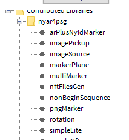

και δημιούργησα έναν φάκελο data, όπου τοποθέτησα όλα τα περιεχόμενα του φακέλου data που περιέχονταν στο NyARToolkit και προσέθεσα και την εικόνα (“planets”), την οποία θα προβάλει το πρόγραμμα όταν αναγνωρίζει τον marker.

Προχωρώντας στον κώδικα:
  Πρώτα, προσέθεσα στην αρχή, μαζί με τις βιβλιοθήκες, την εντολή "PImage img;" για να μπορώ να εισάγω και να επεξεργαστώ την εικόνα.

Πειραματίστηκα με τις διαστάσεις του παραθύρου, μέχρι να βρω τις καταλληλότερες τιμές, και προσάρμοσα τα marker paths, ώστε να καλούνται σωστά τα αρχεία (.dat και patt) που βρίσκονται στον φάκελο data.

Σε αυτή τη φάση προσέθεσα την εικόνα μέσα στην void _draw_ και έτρεξα για πρώτη φορά το πρόγραμμα, όπου φάνηκε η φωτογραφία με το ήδη υπάρχον _box_. 

Συνέχισα αφαιρώντας το κουτί και προσαρμόζοντας το μέγεθος ("image(…,…, x, y)"), την περιστροφή ("rotationZ") και την τοποθέτηση ("translate") της εικόνας σε σχέση με τον marker, εισάγοντας μεταβλητές (για την περιστροφή) από [αυτή]( https://processing.org/reference/rotateZ_.html) τη σελίδα.

Ξανά έτρεξα μερικές φορές το πρόγραμμα με κάθε αλλαγή που έκανα και μετά από προσαρμογές στις παραπάνω μεταβλητές κατέληξα σε αυτό το αποτέλεσμα. 

# 2nd Deliverable
>##  1. Background Removal: 

Αρχικά, άνοιξα το παράδειγμα 16-12. Όρισα μια μεταβλητή Movie για να μπορέσω να χρησιμοποιήσω ένα βίντεο για την αντικατάσταση του background.

Κατέβασα ένα βίντεο της επιλογής μου και το έκοψα, ώστε να μην ξεπερναι τα 10" και το έκανα drag and drop στο πρόγραμμα, βάζοντας το αυτόματα στν φάκελο data του προγράμματος.

Στη συνέχεια επέστρεψα στο πρόγραμμα άλλαξα το size του παραθύρου για να είναι το ίδιο μέγεθος με το βίντεο, καθώς αργότερα αυτό θα βοηθούσε με την καλύτερη αντιστοίχιση και αντικατάσταση των pixel.

Δημιούργησα στην setup ένα καινούριο Movie object και κάλσα το όνομα του βίντεο και το έβαλα να παίξει σε λούπα.

Αντικατέστησα το captureEvent με movieEvent, καθώς θέλουμε να διαβάζεται το βίντεο από το πρόγραμμα.

Τέλος, μέσα στην else, έσβησα το πράσινο χρώμα και έβαλα να αντικαθιστόνται τα "ακίνητα" pixels με τον πίνακα των του βίντεο.

Έτρεξα το πρόγραμμα και δέν φάνηκε αρκετά το βίντεο στο φόντο, οπότε αύξησα το threshold (πόσο διαφέρουν τα pixels πριν και μετά) για να καλυφθούν περισσότερα κενά.

Το τελικό απότέλεσμα είναι αυτο:

>##  2. Motion Detection:

Για αυτό το ερώτημα βρήκα την άσκηση 16-7 έτοιμη στα παραδείγματα του Processing και πειραματίστηκα με την εμφάνιση του σημείου, μετατρέποντάς το σε ορθογώνιο, καταλήγοντας σε αυτό:

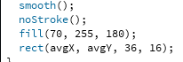

Εδώ είναι το αποτέλεσμα:

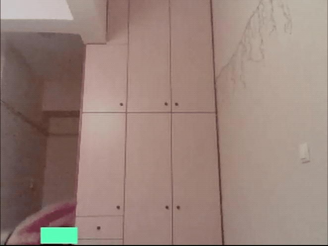

>##  3. Background Substraction:

Σε αυτό το step έπρεπε το βίντεο να αντιατασταθεί με το feed από την κάμερα, οι βιβλιοθήκες περέχονταν ήδη. Ξεκίνησα αφαιρόντας τις μεταβλητές και τα functions που ήταν σχετικά με την προβολή του βίντεο (street.mov). 

Στη συνέχεια, προσέθεσα την μεταβλητή Capture και την αναγκαία μεταβλητή για την έναρξη του βίντεο της κάμερας μέσα στην setup. 

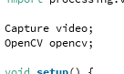 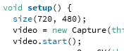

Τέλος, μετέτρεψα την captureMovie σε captureEvent, ώστε να παίζει αυτό που βλέπει η κάμερα.

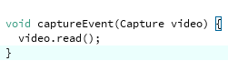

Πλέον το πρόγραμμα ακολουθεί την κίνηση που πιάνει η κάμερα και δημιουργεί ένα περίγραμμα:

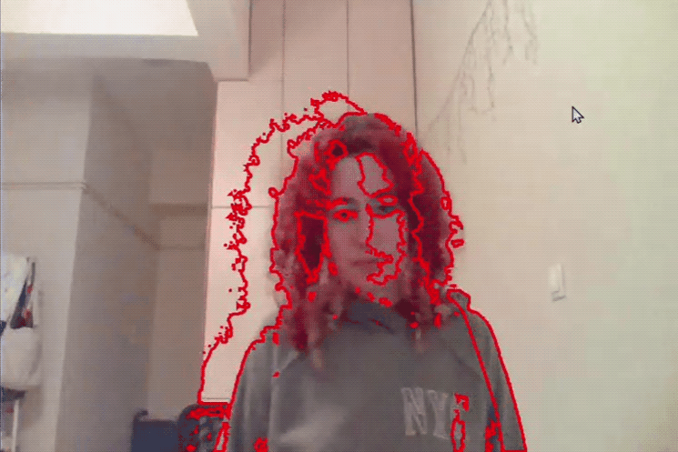

-Πλεονεκτήματα και μειονεκτήματα της έτοιμης βιβλιοθήκης έναντι του κώδικα από το πρώτο ερώτημα:

πλεονεκτήματα: Κάνει τη δουλειά του προγραμματιστή πιο γρήγορη, καθώς διαθέτει έτοιμα εργαλεία και συναρτήσεις που μπορούν να χρησιμοποιηθούν άμεσα. Επείσης, πολλές φορές οι έτοιμες βιβλιοθήκες προσφέρουν μεγαλύτερη ακρίβεια και καλύτερα αποτελέσματα, αφού διαθέτουν καλύτερη και πιο λεπτομερή οργάνωση.

μειονεκτήματα: Δεν διαθέτει όση ευελιξία διασαθέτει η δδημιουργία κώδικα/προγράμματος from scratch. Πολλές από τις μεταβλητές και τα functions είναι προκαθορισμένα, και δεν είναι εύκολο να τροποποιηθούν.

>##  4. Object Tracking:

Για αυτό το βήμα χρησιμοποίησα τον κώδικα από την άσκηση 16-5, και προσάρμωσα τα χρώματα στο φιδάκι ώστε να κάνει μια ομαλή μετάβαση μεταξύ δύο μη βασικών χρωμάτων. Αυτή την αλλαγή την έκανα στην καρτέλα (κλάση) Snake, αφού εκεί ορίζεται το σχήμα ("φιδάκι") και οι παράμετροι για τη δημιουργία αυτών των γραφικών/graphics.

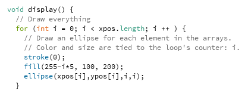

Εδώ είναι το τελικό αποτέλεσμα:

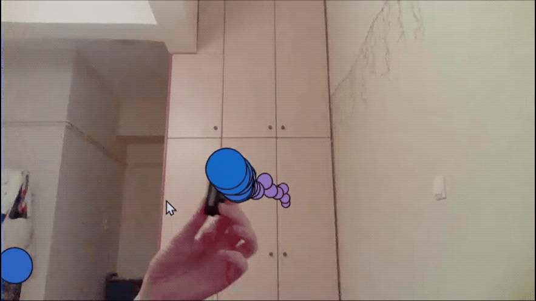

-Πλεονεκτήματα και μειονεκτήματα αυτής της τεχνικής ελέγχου σε σχέση με το παραδοσιακό ποντίκι:

πλεονεκτήματα: Βασικό πλεονέκτημα υτής της τεχνικής είναι ότι δίνει πολύ μεγαλύτερη ευελιξία στο χρήστη να κινήσει το φιδάκι μέσα στο "χώρο". Ακόμα πιο βασικό είναι ότι κάνει την αλληλεπίδραση με το πρόγραμμα πιο ζωντανή, ενεργή και ενδιαφέρουσα για τον χρήστη, από το απλά να κινεί το ποντίκι στην οθόνη του, όπου μπορεί να έχει και μεγαλύτερους περιορισμούς κίνησης.

μειονεκτήματα: Η χρήση αυτής της τεχνικής ελέγχου εξαρτάται σε αρκετά μεγάλο βαθμό από την ποιότητα της εικόνας της κάμερας και τη δυνατότητα του πρτογράμματος και του υπολογιστή να επεξεργαστεί τα δεδομένα από αυτήν. Επίσης, δεν μποιρεί να επιτύχει την ίδια ακρίβεια με το ποντίκι, καθώς το tracking ενός συγκεκριμένου χρώματος δεν έιναι τόσο επιτυχές όταν το φόντο δεν είναι "καθαρό", ή όταν υπάρχουν άλλα παρόμοια χρώματα με αυτό που του έχουμε δώσει να κάνει tracking. 
Με λίγα λόγια, αυτή η τεχνική ελέγχου παράγει περισσότερα σφάλματα, όπως φάνηκε και στην παραπάνω απεικόνιση.

# 3rd Deliverable 

Για το 3ο παραδοτέο, ξεκίνησα εγκαθιστώντας την εφαρμογή reacTIVison και τη βιβλιοθήκη της στο Processing. (Παρόλο που κατέβασα το Java Runtime Environment και τον TUIO Simulator, τελικά δε λειτούργησαν και έκανα το παράδειγμα και την άσκηση με την εφαρμογή της reacTIVison).
  Αρχικά άνοιξα το παράδειγμα “TUIO demo” από την βιβλιοθήκη και το έτρεξα, ανοίγοντας παράλληλα την εφαρμογή της reacTIVison. Το demo με την κάμερα λειτούργησε και μου έδωσε αυτό το αποτέλεσμα. 

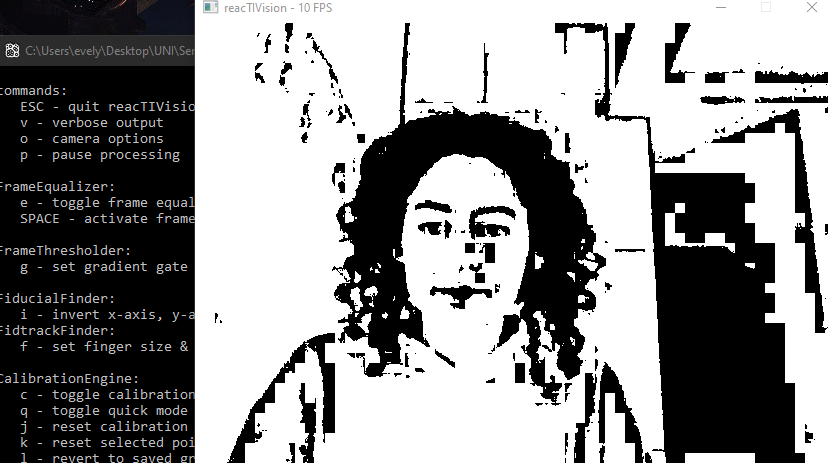

 Στη συνέχεια από τα φίλτρα επεξεργασίας εικόνας στο κεφάλαιο 15 του βιβλίου Learning Processing, επέλεξα να κάνω το tint.
  Αρχικά, ξεκίνησα προσθέτοντας την εικόνα που θα χρησιμοποιήσω, φτιάχνοντας μια μεταβλητή PImage και καταχωρώντας την στην void setup. Έπειτα, στο TuioObject array list στην void draw, έσβησα τις περιττές εντολές για τον σχεδιασμό των γραφικών πάνω στον μάρκερ και προσέθεσα ένα if statement, μέσα στο οποίο έθεσα ότι αν ο μάρκερ που διαβάζει η κάμερα είναι το object 0 της λίστας τότε να εμφανίζει την εικόνα.  

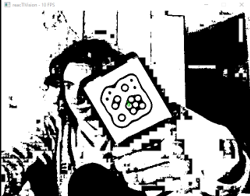 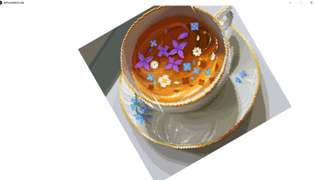
  
Επιπλέον, όρισα και τις μεταβλητές για την αλλαγή του μεγέθους της εικόνας. Έτρεξα το πρόγραμμα και δοκίμασα και να περιστρέψω τον μάρκερ. 

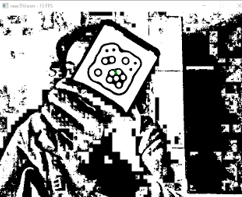 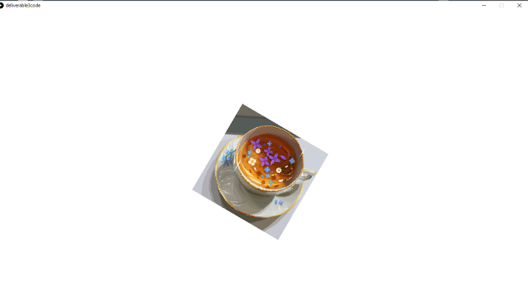

 Τέλος, δοκίμασα να προσθέσω τον κώδικα για τη χρήση δεύτερου μάρκερ για την αλλαγή του χρωματισμού της φωτογραφίας.
Έτσι, έβαλα μια 2η if μέσα στην πρώτη έτσι ώστε αν βρίσκει τον πρώτο μάρκερ να ψάχνει και για τον δεύτερο. Στη συνέχεια, έθεσα τα χρώματα RGB ως public και μέσα στην 2η if έβαλα τον παρακάτω κώδικα στο πράσινο,  

"g = constrain(g + tobj.getRotationSpeed()*70, 0, 255);"

ώστε να γίνεται η φωτογραφία περισσότερο ή λιγότερο μωβ ανάλογα την περιστροφή του 2ου μάρκερ.
  Δυστυχώς δεν πέτυχε αυτό, αλλά η κάμερα έδειξε να διαβάζει και τους 2 μάρκερ.  

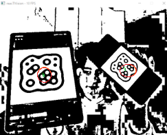

 
Απάντηση στην ερώτηση: Θα ξεκινούσα χρησιμοποιώντας των προσομοιωτή για να δω αν το πρόγραμμα διαβάζει και αναγνωρίζει τα fiducials και εκτελεί τις εντολές σχετικά με τους μάρκερς σωστά, και στη συνέχεια θα δοκίμαζα το πρόγραμμα με την κάμερα, ενώ πλέον γνωρίζω ότι δεν υπάρχει θέμα με τον κώδικα, ώστε να βεβαιωθώ ότι αναγνωρίζει τα fiducials.

# Bonus 1

## Σε συνεργασία με: [dpsd19061](https://github.com/dpsd19061) (dpsd19061 Efstratios Koutoulakis)

### 0. Kinect Installation

--> Για την εγκατάσταση της κάμερας, ακολουθήσαμε πιστά τις οδηγίες από [εδώ](https://fivedots.coe.psu.ac.th/~ad/kinect/installation.html) και συνοδευτικά από τη [σελίδα](https://github.com/merkourisa/Advanced-Interaction-Tecnologies-Applications-Individual-Assignment/issues/4) στο GitHub. Επιπλέον δοκιμάσαμε κάποια έτοιμα παραδείγματα για να σιγουρευτούμε ότι εγκαταστήθηκε σωστά η κάμερα.

### 1. Nearest Point Tracking

--> Αρχικά, ανοίξαμε ένα νέο αρχείο processing, μέσα στο οποίο αντιγράψαμε τον κώδικα από το Project 5 του βιβλίου Making Things See. Έπειτα, ανοίξαμε το Παράδειγμα 9-8 (Learning Processing) και πήραμε τα κομμάτια κώδικα που δημιουργούν το φιδάκι.
  --> Στη συνέχεια, αντικαταστήσαμε τον κώδικα για τον κύκλο που ακολουθούσε την κίνηση του κοντινότερου σημείου με τον κώδικα για το φιδάκι. Τέλος, παίξαμε με τις τιμές και τις μεταβάσεις των χρωμάτων του φιδιού, ώστε να πηγαίνει από μπλε σε κόκκινο.

### 2. Background Removal

--> Για το δεύτερο πρόγραμμα, πήραμε το παράδειγμα Remove_Background_RGB και αντικαταστήσαμε το μαύρο background με ένα βίντεο της επιλογής μας, με τον ίδιο τρόπο που υλοποιήθηκε στο 1ο βήμα του 2ου παραδοτέου.
  --> Ουσιαστικά, ο κώδικας αποθηκεύει αρχικά τα pixel του βίντεο και της κάμερας. Από τα pixels τις κάμερας εμφανίζονται αυτά που αντιστοιχούν στον χρήστη και όλα τα υπόλοιπα αντικαθίστανται με τα pixels του βίντεο.

--> **Απάντηση Ερώτησης:** Τα πλεονεκτήματα της έτοιμης βιβλιοθήκης είναι οτι μπορύμε να χρησιμοποιούμε έτοιμο κώδικα, χωρίς να γράφουμε δικό μας απο την αρχή, πράγμα που γλιτώνει υπερβολικά πολύ χρόνο. Με λίγα λόγια, δεν χρειάζεται να "εφευρίσκουμε τον τροχό από την αρχή". Επιπλέον ένα ακόμα πλεονέκτημα είναι οτι μια βιβλιοθήκη μπορεί να λειτουργεί και να ανταποδίδει καλύτερα αποτελέσματα απο έναν απλό developer γιατί η βιβλιοθήκη έχει κατασκευαστεί από ομάδα επαγγελματιών. Τα μειονεκτήματα της έτοιμης βιβλοθήκης είναι οτι αν έχουμε σκοπό να φτιάξουμε ένα πρόγραμμα με πολύ συγκεκριμένα ζητούμενα, η βιβλιοθήκη ενδεχομένως να μήν μας παρέχει πάντα αυτό που θέλουμε και δεν είναι εύκολο να τροποποιήσουμε τη βιβλιοθήκη με αποτέλεσμα να γράφουμε από την αρχή δικό μας κώδικα έστι ακριβώς όπως τον θέλουμε. **Η kinect μπορεί να αναγνωρίζει πολύ εύκολα τα σωματα των ανθρώπων λόγω της τεχνολογίας της και μπορεί να κάνει πολύ πιο αποτελεσματικά το backround removal**.

### 3. Right-Hand Tracking

--> Τέλος, για το 3ο βήμα πήραμε τον κώδικα από το [άρθρο](http://articlesbyaphysicist.com/simpleopenni_windows_2.html) και τον βάλαμε σε καινούριο αρχείο. Στη συνέχεια, αντικαταστήσαμε τον κώδικα του κύκλου που ακολουθεί το αριστερό χέρι με τον κώδικα του φιδιού. Για τελικές πινελιές, παίξαμε με τις τιμές και τις μεταβάσεις των χρωμάτων του φιδιού, ώστε να πηγαίνει από κίτρινο σε κόκκινο και αλλάξαμε τον κώδικα ώστε η κάμερα να κάνει track το δεξί χέρι αντί το αριστερό.

# Bonus 2

## Σε συνεργασία με: [Evedes01](https://github.com/Evedes01) (dpsd19030 Evangelia Despotidou)

### Music Application

--> Αρχικά, ανοίξαμε το παράδειγμα “chPC_ex10_multi_hotpoint” από το βιβλίο Making Things See και προσπαθήσαμε να καταλάβουμε τι κάνει ο κώδικας. 
  --> Συνειδητοποιήσαμε ότι το πρόγραμμα δεν έδειχνε εικόνα από την κάμερα, αλλά γραφικά απεικόνισης βάθους, οπότε προσθέσαμε τον κατάλληλο κώδικα, ώστε να φαίνεται το βίντεο από την κάμερα. 
  --> Επεξεργαστήκαμε την τοποθεσία της κάμερας στο εικονικό περιβάλλον, ώστε το τρισδιάστατο περιβάλλον να συμπίπτει με το feed από την Kinect. Επειδή, το field of view της Kinect δεν ταίριαζε με το field of view της εικονικής κάμερας, βρήκαμε [κώδικα](https://processing.org/reference/perspective_.html), που κάνει αυτά τα δύο f.o.v. να ταυτίζονται. 
  --> Στη συνέχεια, ψάξαμε και βρήκαμε ηχητικά αποκόμματα και νότες από μουσικά όργανα που θέλαμε να συμπεριλάβουμε. Μετά προσθέσαμε όσους κύβους χρειαζόμασταν και τους στοιχίσαμε στον εικονικό χώρο αλλάζοντας τις μεταβλητές τοποθεσίας και μεγέθους.
  --> Έπειτα, εισαγάγαμε τα ηχητικά κομμάτια και τις μεταβλητές τους, τα οποία, στη συνέχεια, κάναμε assign στους ανάλογους κύβους.
  --> Τέλος, μετατρέψαμε τους κύβους σε σφαίρες, αντικαθιστώντας στον κώδικα το “box” με “sphere”.

### **--> Σε αυτό το [βίντεο](https://www.youtube.com/watch?v=IaqdazY2b4o&ab_channel=%CE%A3%CF%84%CF%81%CE%AC%CF%84%CE%BF%CF%82%CE%9A%CE%BF%CF%85%CF%84%CE%BF%CF%85%CE%BB%CE%AC%CE%BA%CE%B7%CF%82) φαίνεται η υλοποίηση του παραδοτέου.**

# Conclusions

# Sources
