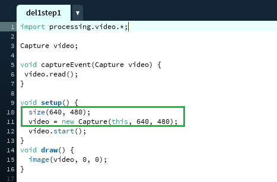

# Lesson: Advanced Interaction Technologies & Applications

### First and Last Name: Evangelia Despotidou
### University Registration Number: dpsd19030
### GitHub Personal Profile: [Evedes01](https://github.com/Evedes01)
### Advanced Interaction Tecnologies & Applications Github Personal Repository: [Advanced Interaction Technologies Personal Repository](https://github.com/Evedes01/Advanced-Interaction-Tecnologies-Applications-Individual-Assignment)

# Introduction

# Summary

# 1st Deliverable
>##  1. Video Capture: 
Για το πρώτο βήμα, ξεκίνησα κατεβάζοντας στο Processing το library για το Video και έπειτα ακολούθησα τις οδηγίες του [συδέσμου](https://processing.org/tutorials/video/#live-video) και του παραδείγματος 16-1 του βιβλίου Learning Processing για να γράψω τον κώδικα. Αφού άλλαξα τις διαστάασεις του παραθύρου

έτρεξα το πρόγραμμα.
 'Οπως φαίνεται παρακάτω, το πρόγραμμα τρέχει σωστά και εμφανίζεται το βίντεο που καταγράφει η κάμερα.

Και η ένδειξη στον compiler:

>##  2. Recorded video: 
Για αυτό το βήμα, συμβουλευόμενη τα παραδείγματα 16-4 και 16-5 του βιβλίου και χρησιμοποιώντας το library που είχα κατεβάσει στο προηγούμενο βήμα, υλοποίησα την προβολή του βίντεο. Αρχικά, έγραψα τον κώδικα σ΄ύμφωνα με τα παραδείγματα και και δηημιούργησα έναν φάκελο "data" (στον ίδιο φάκελο με το πρόγραμμα), όπου μέσα τοποθέτησα το βίντεο. 

Συνειδητοποιώντας τον όγκο του αρχείου, επεξεργάστηκα το βίντεο με σκοπό να το μικρύνω (με compression και επιταχύνοντας το αρχικό animation, για να ελαχιστοποιηθεί το μήκος του).

Όσων αφορά τον κώδικα, πάλι προσάρμωσα τις διαστάσεις του παραθύρου, ώστε να ταιριάζουν με αυτές του βίντεο.

Έπειτα, το έτρεξα και δοκιμασα την επιβράδυνση και την επιτάχυνση του βίντεο σερνοντας το ποντίκι οριζοντίως πάνω του...

 

και λειτούργησε ομαλά, το βίντεο έπαιζε σε λούπα και στις διαφορετικές ταχύτητες.

>##  3. QR Code:  
Για την δημιουργία του QR code επισκέφτηκα [αυτή](https://www.qrcode-monkey.com/?utm_source=google_c&utm_medium=cpc&utm_campaign=&utm_content=&utm_term=qrcode%20monkey_e&gclid=CjwKCAjw8JKbBhBYEiwAs3sxN6yxfBJHuRFeC35FTpOlhm42mXNSqnNOPvVUIutf8s3RqK6aTZ6WOBoC8PsQAvD_BwE) την ιστοσελίδα και αφού το έφτιαξα, το κατέβασα και το τοποθέτησα στον φάκελο data. 
  Για το πρόγραμμα, αρχικά, κατέβασα την βιβλιοθήκη για το QR Code από το σχετικό [link](https://shiffman.net/p5/qrcode-processing/) (ανοίγοντας τα Developer tools, καθώς αντιμετώπιζε κάποιο πρόβλημα το link στην ιστοσελίδα). 
 Στη συνέχεια, αντέγραψα τον κώδικα της ιστοσελίδας στο Processing και προσέθεσα και κάποια στοιχεία του κώδικα από το παράδειγμα 15-1 του βιβλίου, όπως το "PImage img;" για να μπορώ να εισάγω και να χρησιμοποιήσω την εικόνα του QR:

Προσάρμωσα τις διαστάσεις του παραθύρου (πορτοκαλί) και της εικόνας (γαλάζιο):

Για να μπορεί να ανοίξει το decoded κείμενο/link του GitHub προφίλ μου σε νέο παράθυρο στον browser:
 
 Χρησιμοποίησα ένα switch case όπως στον κώδικα του βήματος 4, και προσέθεσα και προσάρμωσα τη γραμμή κώδικα που βρήκα [εδώ](https://processing.org/examples/embeddedlinks.html), αντικαθιστώντας το απλό link με την εντολή "decoder.getDecodedString()" που περιέχει το decoded link του QR σε string.

Τέλος, έτρεξα το πρόγραμμα:
  Εμφανίστηκε η εικόνα του QR (και από τον compiler φάνηκε ότι διάβασε το QR code)

 

και πατώντας το πλήκτρο "i" (όπως είναι καταχωρημένο στο switch case), το πρόγραμμα επιτυχώς άνοιξε το GitHub profile στον browser.

>##  4. QR Code - Camera Read: 

>##  5. Augmented Reality:  

# 2nd Deliverable

# 3rd Deliverable 

# Bonus 

# Conclusions

# Sources
